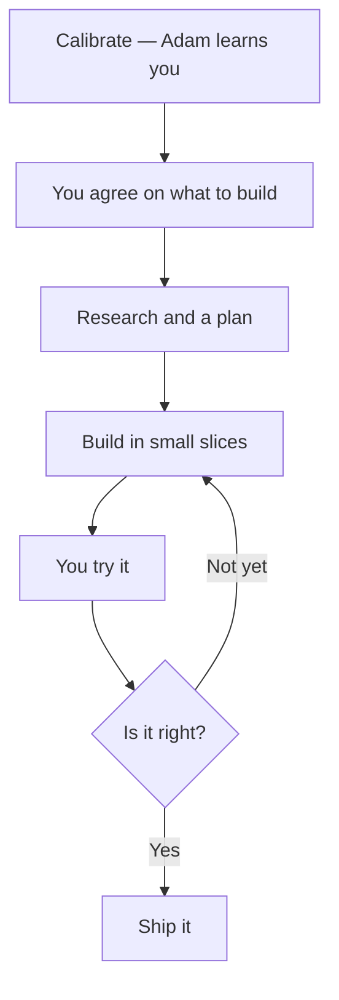

<p align="center">
  
</p>

# The Adam Repo

Bolt this onto the coding agent you already like, and you have a software factory.

You stay in the CEO seat. Adam acts as your CTO. You need to understand the problem well enough to know when the solution is right. That is your job. Adam helps with the rest.

Cursor is the path we write down first. If your agent can load skills and project rules, you can run the same factory.

Why we built it: [justinmendez.ai/the-adam-repo](https://justinmendez.ai/the-adam-repo)

> “Whoever gathered much had nothing left over, and whoever gathered little had no lack.”
>
> — *Exodus 16:18*

---

## Quick start

You need Git and a coding agent. We document [Cursor](https://cursor.com) first.

```bash
git clone https://github.com/Justinmendezai/The-Adam-Repo.git ~/adam
mkdir -p ~/.cursor/skills
for s in ~/adam/skills/*/; do
  ln -sf "$s" ~/.cursor/skills/"$(basename "$s")"
done
```

1. Open **your product folder** in Cursor (the thing you want to build — not this repo, unless you are hacking on Adam itself).
2. Run **`calibrate`**. Adam interviews you once.
3. Run **`setup-adam`** in that folder. That creates the project files Adam needs.
4. Tell Adam what you are building. If a decision is unclear, ask **`/what`**.

Step-by-step: [`docs/bootstrap.md`](docs/bootstrap.md). Never coded? Pick *Teach me* during calibrate and skim [`docs/fundamentals/`](docs/fundamentals/).



---

## What’s in the box

Five parts: **context**, **skills**, **rules**, **loop gates**, and **tools**.

| Part | What it does |
|------|----------------|
| [**Context**](#context) | How Adam knows you and the project. Written once during `calibrate`. |
| [**Skills**](#skills) | What Adam can do — interview, plan, build, test, review, hand off. |
| [**Rules**](#rules) | What every agent in your project must follow. Copied in by `setup-adam`. |
| [**Loop gates**](#loop-gates) | Grill before plan, tests before workers, review before merge, handoff before the chat dies. |
| [**Tools**](#tools) | Optional helpers for review: structure, logs, browser. |

---

## Context

Adam reads these before he answers in a calibrated project. `calibrate` writes them. Keep them in **your product repo**.

| File | Job |
|------|-----|
| `adam/context/user-profile.md` | Who you are |
| `adam/context/technical-level.md` | How much to explain |
| `adam/context/preferences.md` | How you like to work |
| `adam/context/founder.md` | The story behind the product |
| `adam/context/project.md` | What this repo is |

Templates: [`adam/context/`](adam/context/). After `setup-adam`, project memory also lives in `agent-control/` (what’s in flight, what landed, what the next session should do).

---

## Skills

Point your coding agent at `skills/`. On Cursor, that’s the symlink loop above.

### Start

| Skill | What it does |
|-------|----------------|
| [`calibrate`](skills/calibrate/SKILL.md) | Interviews you once and writes context files |
| [`setup-adam`](skills/setup-adam/SKILL.md) | Creates `packet/`, `plan/`, `slices/`, and `agent-control/` in your product repo |
| [`adam-foundation-sync`](skills/adam-foundation-sync/SKILL.md) | Copies rules and the folder layout into a project |
| [`what`](skills/what/SKILL.md) | Explains a decision in plain language, with tradeoffs — invoke as **`/what`** |

### Figure it out

| Skill | What it does |
|-------|----------------|
| [`intake`](skills/intake/SKILL.md) | Turns a raw idea into plan updates |
| [`grill-me`](skills/grill-me/SKILL.md) | Interviews you until the decision tree is closed |
| [`grill-with-docs`](skills/grill-with-docs/SKILL.md) | Same grilling, written into `CONTEXT.md` and ADRs |
| [`packet-intake`](skills/packet-intake/SKILL.md) | Checks the packet and grills before the build starts |
| [`brainstorm`](skills/brainstorm/SKILL.md) | Strategy only — no code |
| [`zoom-out`](skills/zoom-out/SKILL.md) | Asks what a piece of the system is for before changing it |

### Plan

| Skill | What it does |
|-------|----------------|
| [`research-and-plan`](skills/research-and-plan/SKILL.md) | Researches the problem and writes the plan |
| [`dispatch-research`](skills/dispatch-research/SKILL.md) | Sends a narrow research brief and brings findings back |
| [`to-prd`](skills/to-prd/SKILL.md) | Turns the conversation into a PRD |
| [`council`](skills/council/SKILL.md) | Runs seven perspectives on the plan, then synthesizes |
| [`grill-then-council`](skills/grill-then-council/SKILL.md) | Grills you first, then runs council |
| [`slice-to-tasks`](skills/slice-to-tasks/SKILL.md) | Breaks the plan into vertical slices |
| [`tests-first`](skills/tests-first/SKILL.md) | Writes the failing tests before any builder touches code |
| [`to-issues`](skills/to-issues/SKILL.md) | Turns slices into issues (GitHub, Linear, or files) |
| [`prototype`](skills/prototype/SKILL.md) | Throwaway prototype when the design isn’t obvious yet |

### Build

| Skill | What it does |
|-------|----------------|
| [`orchestrate`](skills/orchestrate/SKILL.md) | Writes the paste-ready prompt for a build run |
| [`orchestrate-build`](skills/orchestrate-build/SKILL.md) | Walks the slice graph, dispatches work, re-runs verifiers |
| [`dispatch-manager`](skills/dispatch-manager/SKILL.md) | Per-slice manager when you want an extra layer |
| [`dispatch-builder`](skills/dispatch-builder/SKILL.md) | One builder for one slice |
| [`dispatch-parallel`](skills/dispatch-parallel/SKILL.md) | Several independent slices at once |
| [`babysit-builders`](skills/babysit-builders/SKILL.md) | Watches in-flight builders and retries before escalating |
| [`tdd`](skills/tdd/SKILL.md) | Red-green-refactor for work you do in this chat |

### Check

| Skill | What it does |
|-------|----------------|
| [`review-via-graph`](skills/review-via-graph/SKILL.md) | Structural review of a branch |
| [`review-runtime`](skills/review-runtime/SKILL.md) | Runs the app and checks the slice against real behavior |
| [`e2e-acceptance`](skills/e2e-acceptance/SKILL.md) | Final pass after slices are merged |
| [`security-audit`](skills/security-audit/SKILL.md) | Read-only security inventory |
| [`dev-launch-debug`](skills/dev-launch-debug/SKILL.md) | Unblocks a broken local run |
| [`diagnose`](skills/diagnose/SKILL.md) | Disciplined loop for hard bugs |

### Keep going

| Skill | What it does |
|-------|----------------|
| [`handoff`](skills/handoff/SKILL.md) | Compacts this chat so the next one can continue |
| [`handoff-prompt`](skills/handoff-prompt/SKILL.md) | Handoff plus a paste-ready kickoff prompt |
| [`context-primer`](skills/context-primer/SKILL.md) | Compresses state around 50–60% of the context window |
| [`session-steward`](skills/session-steward/SKILL.md) | Writes the run ledger and refreshes the next brief |
| [`steward`](skills/steward/SKILL.md) | Same job as session-steward, operator name |
| [`repo-truth`](skills/repo-truth/SKILL.md) | Git vs docs — what actually landed |
| [`merge-manual`](skills/merge-manual/SKILL.md) | Merges approved branches and gives you a QA list |
| [`ship`](skills/ship/SKILL.md) | Commit and push with safe defaults — **`/ship`** |
| [`go`](skills/go/SKILL.md) | Proceed without re-pitching — **`/go`** |
| [`canvas-project`](skills/canvas-project/SKILL.md) | Visual project status |
| [`triage`](skills/triage/SKILL.md) | Moves issues from inbox to ready |

### Commands

These are skills you invoke on purpose (slash or by name):

| Command | Skill |
|---------|--------|
| `/what` | Calibrated explanation + tradeoffs |
| `/go` | Proceed |
| `/ship` | Commit + push |
| `/brainstorm` | Strategy, no code |
| `/intake` | Idea → plan |
| `/repo-truth` | Git vs docs |
| `/council` | Seven perspectives |
| `/grill-then-council` | Grill, then council |
| `/dispatch-research` | Narrow research brief |
| `/orchestrate` | Paste-ready build prompt |
| `/steward` | Sync run docs |
| `/handoff-prompt` | Handoff + kickoff |
| `/merge-manual` | Merge + QA list |
| `/canvas-project` | Status canvas |

Agent index: [`AGENTS.md`](AGENTS.md).

---

## Rules

Copied into your project by `setup-adam` from [`foundation/cursor/rules.md`](foundation/cursor/rules.md). Every agent in that project is supposed to follow them.

- Prefer checks you can run over model opinion.
- You own `packet/`. Agents do not edit it.
- Build in vertical slices (one user-visible behavior), not layers.
- The high-level agent writes tests. Builders only make them green. Builders do not edit test files.
- No secrets in the repo. No live credentials in tests.
- Small diffs. Don’t rewrite files you weren’t asked to touch.

Cursor-specific operator detail (auto-merge, model names, MCP paths) stays in that file.

---

## Loop gates

There is no `hooks/` folder in this repo yet. Cursor hook scripts are not shipped.

What we do ship is the sequence skills are supposed to run:

1. **Grill / packet-intake** before the plan is treated as settled.
2. **`tests-first`** before any builder writes product code.
3. **Review** (`review-via-graph`, then `review-runtime` when the slice has a UI) before merge.
4. **`context-primer` / `session-steward`** before the chat gets too heavy.

The hard fail is `verify.sh` (and the test suite). `orchestrate-build` re-runs those itself. Rules and skills are instructions. The verifier is the gate that actually fails.

Optional beginner one-liners in a slice spec are **teach hooks** — explanations, not enforcement. See [`docs/teach-while-building.md`](docs/teach-while-building.md).

---

## Tools

Optional. Review skills work better with them. Example config: [`foundation/cursor/mcp.example.json`](foundation/cursor/mcp.example.json).

| Tool | What Adam uses it for |
|------|------------------------|
| **code-review-graph** | Structural review (`review-via-graph`) |
| **log-reader-mcp** | App logs during runtime review |
| **chrome-devtools** | Drive the UI for `review-runtime` and `e2e-acceptance` |
| **Playwright MCP** | Optional browser path, same jobs |

These are not required to clone and calibrate. Add them when you want review to look at a running app instead of a diff.

---

## Folders in this repo

| Path | Job |
|------|-----|
| `skills/` | What Adam can do |
| `adam/context/` | Context templates |
| `foundation/` | Rules, folder contract, MCP example — copied into *your* project |
| `packet/` | Brief template for a new product |
| `council/` | Perspectives + runbook for the optional council pass |
| `docs/` | Bootstrap and fundamentals |
| [`AGENTS.md`](AGENTS.md) | Index for other agents working in this repo |

---

## Inspired by

Seeded from [Matt Pocock’s skills](https://github.com/mattpocock/skills), then grown from other open-source projects — agents read public skill repos and coding-agent work, then wrote the versions that fit this factory.

---

## License

Apache License 2.0 — see [`LICENSE`](LICENSE). Free to use. No paid support for the repo itself; see [`docs/reasonable-limit.md`](docs/reasonable-limit.md).

Do not commit secrets into `packet/` or `adam/context/`. More in [`docs/SECURITY.md`](docs/SECURITY.md).
