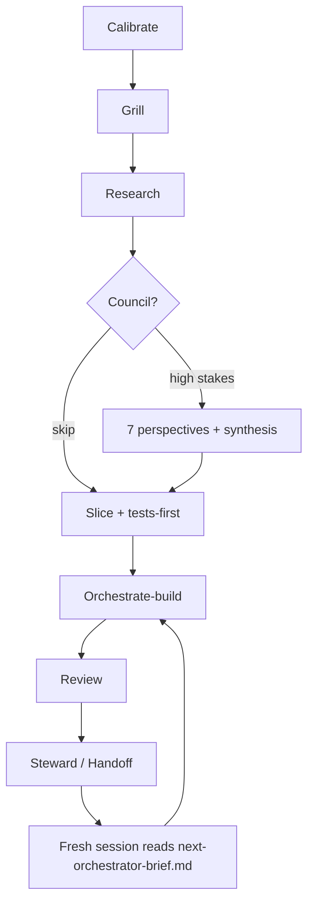

# Adam — NotebookLM source pack

> **Purpose:** Upload this file (plus optional links to `README.md`, `AGENTS.md`, `docs/bootstrap.md`) into NotebookLM. Use it to generate visuals, explainers, scripts, and atomized content across depth levels.
>
> **Audience for content:** founders, indie hackers, AI-curious builders, and professional engineers who want a structured way to build with a coding agent.

---

## One-line identity

**Adam helps you build software with a coding agent.** He interviews you once, remembers the project, researches, plans, builds in small pieces, tests the work, and hands off cleanly between sessions. Bolt him onto the agent you already like.

**Tagline options for content:**

- Build the solution to your problems.
- You stay in the CEO seat. Adam acts as your CTO.
- Before we build anything, Adam wants to understand what you're creating.

---

## Levels of information (content ladder)

Use these six levels to atomize one recording or one doc into dozens of pieces. **Same truth, different depth.** Never skip a level's proof — each level should stand alone.

| Level | Name | Length | Job | Example formats |
|-------|------|--------|-----|-----------------|
| **L0** | Hook | 5–15 words | Stop the scroll | Short title, thumbnail text, first line of a post |
| **L1** | Category | 1–3 sentences | "What bucket is this?" | Tweet, Short hook, ad headline |
| **L2** | Loop | 60–90 seconds | Show the **shape** of the system | Short video, carousel slide 1–3, Skool teaser |
| **L3** | Operator | 3–7 minutes | **When** to use which command/skill | YouTube Short series, LinkedIn how-to, tutorial clip |
| **L4** | Practitioner | 10–25 minutes | **How** folders, slices, orchestrator tiers work | Long YouTube, workshop segment, paid community lesson |
| **L5** | Reference | As needed | Exact contracts, anti-patterns, schemas | Docs page, GitHub README section, cheat sheet PDF |

**Content rule:** L0–L2 sell **clarity and trust**. L3–L4 sell **competence**. L5 is **lookup**, not entertainment.

**Atomization example (one topic → many pieces):**

Topic: *"Tests-first in Adam"*

- L0: "Your agent shouldn't write code before the tests exist."
- L1: "Adam splits roles: the orchestrator writes failing tests; workers only make them green."
- L2: Walk the loop diagram — calibrate → … → tests-first → build → review.
- L3: Demo invoking `/tests-first` after `slice-to-tasks`; show red suite.
- L4: Explain why workers must not edit test files; Tier-1 re-runs `verify.sh`.
- L5: Link `skills/tests-first/SKILL.md` + slice folder layout.

Repeat for every command in the operator table below.

---

## L0 hooks (ready to paste)

Pick one per piece; pair with proof from your own build session when possible.

1. Most AI coding fails because nobody owns the **workflow** — Adam does.
2. Stop pasting the same "implement the plan" paragraph. Use **commands**.
3. Calibration beats configuration: Adam asks who you are before it asks what to build.
4. Seven perspectives, one synthesis — **disagreement extraction**, not AI democracy.
5. Vertical slices, not horizontal layers — ship behavior, not "the API layer."
6. Paths, not paragraphs — orchestrators pass file paths, not 400-line specs in chat.
7. Context windows are finite — **hand off at 50%, not at confusion.**
8. One voice to you; research and council stay invisible unless you ask.
9. Bolt Adam onto the agent you already use and keep building.
10. Open skills, your product, your repo.

---

## L1 category blurbs

**For founders who never coded:** Adam is a patient project partner in Cursor. It interviews you once, explains steps in plain language, breaks big ideas into small shippable pieces, and never dumps jargon without defining it.

**For professional engineers:** Adam runs the build: a packet, a slice list, tests before workers touch code, optional council, review, and a handoff so the next session can pick up without rereading the whole chat.

**For AI-tool skeptics:** You still work in your coding agent and you still own git. Adam organizes how the agent works — small pieces, tests, and you decide when it's right.

---

## L2 — The Adam loop (visual script)

Use this as a voiceover or diagram source.

```text
CALIBRATE          →  Adam learns you (once)
       ↓
GRILL              →  Close forks before building (major features)
       ↓
RESEARCH           →  Explore subagents gather facts → scratch/research/
       ↓
COUNCIL (optional) →  7 perspectives, 1 synthesis, then STOP
       ↓
SLICE + TESTS      →  Vertical behaviors; orchestrator writes failing tests
       ↓
BUILD              →  Tier-1 orchestrator → workers on adam/<slice-id> branches
       ↓
REVIEW             →  Graph, runtime, security, e2e — orchestrator verifies
       ↓
STEWARD / HANDOFF  →  Compress to agent-control/; fresh chat reads one brief
```

**Mermaid (for slides / NotebookLM visuals):**



**Two operator touchpoints (content angle):** (1) calibration + upfront grilling; (2) taste / judgment queue. Everything between can run autonomously.

---

## L3 — Operator commands (slash skills)

These are **explicit invocations** in Cursor (`/go`, `/ship`, etc.). Each is a content series.

| Command | One sentence | When |
|---------|--------------|------|
| `/what?` | Break down any question — calibrated plain English, pro/con, OSS examples for agents | Confusion, new terms, "should we…?" |
| `/calibrate` | First-run interview → `adam/context/*` | New founder or new venture |
| `/setup-adam` | Scaffold packet, plan, slices, agent-control | New product repo |
| `/intake` | Raw idea → packet/plan edits | New feature idea in `ideas/` |
| `/grill-me` | Interview until decisions are closed | Before planning |
| `/grill-then-council` | Grill first, then council on settled INPUT | Big bets |
| `/brainstorm` | Strategy mode — no code | Architecture / scope forks |
| `/dispatch-research` | Narrow research brief | Unknown tech or market fact |
| `/council` | Seven perspectives, one synthesis | High-stakes plan |
| `/slice-to-tasks` | Decompose plan → vertical slices | After plan approved |
| `/tests-first` | Orchestrator writes red suite | Before any worker code |
| `/orchestrate` | Paste-ready build orchestrator prompt | Start build wave |
| `/orchestrate-build` | Tier-1 walks slice registry | Active build session |
| `/repo-truth` | Git vs docs audit | After merges / confusion |
| `/steward` | Refresh next-orchestrator-brief | End of build cycle |
| `/handoff-prompt` | Handoff file + KICKOFF prompt (+ optional workspace switch) | Switch agent or repo |
| `/merge-manual` | Merge slices + manual QA checklist | Landing branches |
| `/ship` | Safe commit/push | End of slice |
| `/go` | Proceed — no re-pitch | You already said yes |
| `/canvas-project` | Visual status canvas | Status share / content B-roll |

**Series idea:** "Adam in 60 seconds" — one command per Short.

---

## L4 — Practitioner concepts (deep explainers)

### Calibration vs memory

| Layer | Path | Mutability | Read by |
|-------|------|------------|---------|
| **Context** | `adam/context/` | Stable; refresh on major life/project change | Every agent, every session |
| **Memory** | `adam/memory/*` | Append on decisions, bugs, architecture | Orchestrator + stewards |
| **Agent control** | `agent-control/` | Updated each build cycle | Build orchestrator |
| **Scratch** | `scratch/` | Ephemeral working notes | Anyone; gitignored optional |

**Technical level** (`adam/context/technical-level.md`) gates explanation depth: never-coded → beginner → intermediate → professional.

### Packet (input contract)

Human-owned, agent **read-only**. Contains goals, success criteria, constraints, verification layers. Workers cannot silently expand scope — ambiguities surface in grilling.

### Vertical slices

A slice = **one user-visible behavior**, not a layer. Includes `SPEC.md`, `verify.sh`, tests. Workers read specs by path; orchestrator passes paths, not pasted contents.

**Anti-pattern content angle:** "Add the API layer" is not a slice. "Logged-in user creates a project persisted to DB" is.

### Two-tier orchestration

- **Tier 1** (`orchestrate-build`): walks `slice-status.md`, dispatches work, **re-runs verifiers itself** — never trusts worker self-report.
- **Tier 2** (`dispatch-manager`, optional): per-slice manager when `topology_depth: 3` in `.cursor/adam.json`.

Default public posture: **topology_depth 2** (orchestrator → worker).

### Engineering council

Fixed perspectives (`first-principles`, `executor`, `reliability-critic`, `cost-critic`, `expansionist`, `contrarian`, `outsider`). Deterministic output sections. **One pass.** Value = surfaced disagreement before code.

### Handoff philosophy

Long chats rot. At ~50–60% context (or session end): `context-primer` + `session-steward` → `agent-control/next-orchestrator-brief.md`. Next chat reads **one file**, not the transcript.

**Cross-workspace note:** No API auto-spawns a new agent in another repo. Options: copy KICKOFF prompt; or approve `move_agent_to_root` and continue in same chat.

### Deterministic over inference

Prefer: schema validation, regex, `verify.sh`, council section templates, slice status registry.  
Use LLM: perspective reasoning, ambiguous product tradeoffs, copy that requires taste.

**Content hook:** "Over-using AI inference is building a fragile house" — Adam puts gates in files, not vibes.

---

## L5 — Reference anchors

Point content CTAs here:

| Doc | Role |
|-----|------|
| `README.md` | Public face, quick start |
| `AGENTS.md` | Skill index for agents |
| `docs/bootstrap.md` | Install + symlink skills |
| `docs/reasonable-limit.md` | Support posture |
| `foundation/repo/folder-contract.md` | Full tree |
| `council/runbook.md` | Council procedure |
| `skills/*/SKILL.md` | Command implementations |
| `docs/fundamentals/` | App literacy modules 1–9 (Stage 0–1) |

---

## Fundamentals series (app building blocks)

Separate from **operator commands** (L3). These modules teach **universal app literacy** for never-coded / beginner founders — read standalone or via opt-in **teach-while-building** hooks on slices.

**Source folder:** `docs/fundamentals/`

| # | Topic | Atomization angle |
|---|--------|-------------------|
| 1 | What is an app (client vs server) | L0: "Your button isn't magic — there's a kitchen." |
| 2 | Code, files, repo | L2: Cursor vs product folder vs Adam repo |
| 3 | Git save points & branches | L3: Why `adam/<slice-id>` exists |
| 4 | Frontend vs backend | L2: Dining room vs kitchen reprise |
| 5 | Database basics | L1: Rows, not Excel on the server |
| 6 | APIs & requests | L3: "Asking the server nicely" |
| 7 | Env vars & secrets | L3: Why `.env` never commits |
| 8 | Deploy & hosting | L2: "Live" = code on someone else's computers |
| 9 | What AI builds vs what you verify | L4: Deterministic gates, not vibes |

**Module card fields (each file):** promise · simple/practical/technical layers · failure mode · verification · teach hook · route-out links.

**NotebookLM prompts (fundamentals-specific):**

1. "From Module 1, generate 10 L0 hooks for never-coded founders."
2. "Turn Module 3 into a 60-second voiceover + 3 carousel slides."
3. "Draft a meta post: 'AI explained git — 3 mistakes in the draft.'"
4. "Quiz: frontend vs backend — 5 scenarios, answer key."

**Teach-while-building:** When calibration = *Teach me*, orchestrator may paste a module's **Teach hook** (≤90 sec) before a slice. `/what?` stays on-demand.

---

## Content angles (orthogonal to levels)

Mix **level** (depth) with **angle** (lens). Same L2 loop can become 5 videos:

| Angle | Lens | Example title |
|-------|------|----------------|
| **Builder in public** | Shipping real repo | "I wired Adam into my SaaS this week" |
| **Anti-hype** | vs magic auto-builders | "Why I don't let the agent merge to main" |
| **Founder** | Non-technical | "Adam interviewed me before writing code" |
| **Engineer** | Systems | "Paths not contents: how orchestrators stay lean" |
| **Workflow** | Cursor-native | "13 slash commands I stopped re-typing" |
| **Quality** | Tests-first | "Red suite before Composer touches src/" |
| **Team of one** | Council | "I argue with seven chairs before one commit" |
| **OSS** | Community | "Fork Adam, keep your product private" |

---

## Dual-brand note (optional — for your personal channel only)

If you also teach as a founder-operator:

- **Personal brand:** teach the loop, tradeoffs, failures, Cursor workflow.
- **Product brand (separate):** outcomes proof — what shipped, metrics, customer results.

---

## Suggested NotebookLM prompts

After upload, ask NotebookLM:

1. "Create a slide deck explaining L0–L5 with one example each."
2. "Generate 30 Shorts hooks from the L0 list, grouped by angle."
3. "Draw a poster of the folder contract for beginners vs engineers."
4. "Write a 4-week content calendar: 3 Shorts + 1 long per week from this ladder."
5. "Quiz me on the difference between context, memory, and agent-control."
6. "Produce a FAQ for skeptics who think this is just another `.cursorrules` file."

---

## Fact sheet (deterministic — do not hallucinate beyond this)

- **License:** Apache-2.0  
- **Primary IDE:** Cursor (skills, rules, MCP, subagents)  
- **Branch convention:** `adam/<slice-id>`  
- **Default topology:** 2 tiers (orchestrator → worker)  
- **Council size:** 7 perspectives, 1 synthesis, no recursion  
- **Author:** Justin Mendez  

---

## Visual ideas for NotebookLM / manual design

1. **Loop poster** — vertical flowchart (L2 mermaid above).
2. **Folder tree** — simplified 3-column: Input (packet) | Plan (plan, slices) | Meta (agent-control).
3. **Command cheat sheet** — grid of slash commands by phase (bootstrap → handoff).
4. **Level ladder** — staircase graphic L0→L5 with format icons (Short, LinkedIn, YouTube, doc).
5. **Before/After** — "Chat transcript chaos" vs "next-orchestrator-brief.md one-pager."
6. **Council wheel** — seven seats around INPUT doc, synthesis in center.

---

*End of source pack. Regenerate atomized content by picking Level × Angle × Command.*
