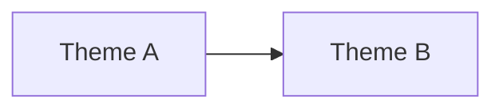

# Task graph

Themes and dependencies at a **high level**. Prefer linking to `slices/README.md` for the authoritative slice DAG rather than duplicating it.

```mermaid
flowchart LR
  themeA[Theme A]
  themeB[Theme B]
  themeA --> themeB
```

## Notes

- 
